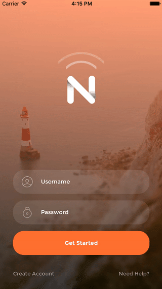

# ScaleTransition

Custom modal transition animation



## Requirements

- iOS 8.0+
- Xcode 7.2

## Installation

Just add the ``` ScaleTransition.swift ``` file to your project.

or use [CocoaPods](https://cocoapods.org) with Podfile:
``` ruby
pod 'ScaleTransition', '~> 1.0.3'
```

## Usage


``` swift
// create viewcontroller
let storyboard = UIStoryboard(storyboard: .Main)
let detail: DetailViewController = storyboard.instantiateViewController()

// configure transition    
detail.transitioningDelegate = self
detail.modalPresentationStyle = .Custom

// present viewController    
navigationController?.presentViewController(detail, animated: true, completion: nil)
```

``` swift
// MARK: transition delegate
extension ViewController: UIViewControllerTransitioningDelegate {

  func animationControllerForPresentedController(presented: UIViewController,
                           presentingController presenting: UIViewController,
                                   sourceController source: UIViewController) -> UIViewControllerAnimatedTransitioning? {

    return ScaleShowTransition(duration: 0.5, scale: 0.9)
  }


  func animationControllerForDismissedController(dismissed: UIViewController) -> UIViewControllerAnimatedTransitioning? {
    return ScaleHideTransition(duration: 0.5, scale: 0.9)
  }
}
```

## Licence

ScaleTransition is released under the MIT license.
See [LICENSE](./LICENSE) for details.

## About

If you have any questions, you can write me dev.aleksey@yandex.ru
